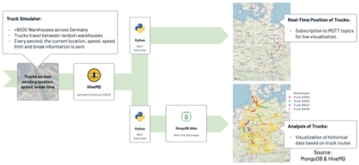

# HiveMQ & MongoDB Fleet Management Demo

This is the repository referenced in the webinar about "Building a scalable and reliable IoT platform with MongoDB and HiveMQ" that I did together with Dominik Obermaier from HiveMQ. Please find additional information here:

* [Slides on SlideShare](https://www.slideshare.net/ChristianKurze01/building-a-scalable-and-reliable-iot-platform-with-hivemq-and-mongodb)
* [Recap of the Webinar on LinkedIn Pulse](https://www.linkedin.com/pulse/recap-webinar-building-reliable-scalable-iot-platform-kurze/?articleId=6672172140642484224)
* [Guest post HiveMQ Blog](https://www.hivemq.com/blog/building-a-reliable-and-scalable-iot-platform/)
* [Recording of the Webinar](https://www.mongodb.com/presentations/building-a-scalable-and-reliable-iot-platform-with-mongodb-and-hivemq)

The fleet management demo intents to show how HiveMQ can MongoDB can interact with each other. The combination of both solves the typical IoT challenges:

* **Many different types of data need to be integrated.** Device data arrives in various formats (JSON, Avro, Protobuf, custom binary formats). In most cases, we talk about time series data. Data agnostic message brokers are used to distribute data into the backend of IoT solutions and relational databases that are often not suited for IoT data.
* **Systems have to be responsive.** Low latency is critical for many, if not all, IoT use cases. End users simply expect responsive systems. Users do not want to wait for 30 seconds or minutes for an IoT system to respond when their messaging services can send text, voice, and images around the globe within seconds. Unreliable cellular networks can have a significant impact on responsiveness. A very good example is the HiveMQ case study with BMW / ShareNow on how to gather data and execute remote commands for a carsharing fleet.
* **IoT solutions need to scale to accommodate growth** from 100’s to 1,000,000s of devices and scale up and down to accommodate spikes. But it is not just large-scale, there also have to be offerings for small-scale solutions.
* **IoT data needs to integrate into enterprise systems** such as ERP and CRM and allow stable device-to-cloud and cloud-to-device integration. In addition to system integration, *management tools* such as monitoring, alerting, backup, and the necessary **security must be in place**.
* **IoT solutions from the edge to the cloud need deployment agnostic technologies:** On-premises deployments of gateways close to the origin of the data such as for manufacturing or inside of connected cars that are deployed in private and/or public clouds up to fully managed services in the cloud benefit from non-proprietary technology.

## Credits

Credits to Simon Bayer @sbaier1 from HiveMQ for the generator.

## Demo Overview

We selected fleet management for our example because it is a very broad use case. We talk about trucks, but it can be any kind of fleet - vehicles, forklifts, trains, goods, and so on. Literally, anything that forms a fleet and needs to be monitored and managed.

The major challenges are the distribution of the devices, unstable connections, and a large scale. Companies see numerous benefits such as the reduction of shipping costs, fewer outages, less damage, fast reaction times to changes as well as carbon dioxide optimization and regulatory compliance of their fleet.



The truck simulator sends trucks on random routes between about 9000 warehouses that have been extracted from OpenStreetMap. Each truck sends data every second about the current location of the truck, the speed, the current speed limit, and a flag if the driver is taking a rest.

There are two subscribers to the data. The first subscriber displays the latest information on a map, the second subscriber transfers the data to MongoDB for analysis of historical data. We chose the option of Python-based subscribers to give you quick insight into how to build the toolchain. We recommend using extensions in HiveMQ. The extensions are much easier to maintain, scale, and monitor as well as simple to set up for high availability.

We built a plotly dash web application that works as the fleet management dashboard combining real-time and historical data.

Summary of the used tools:
- HiveMQ CE as the MQTT broker
- MongoDB Atlas as the database for real-time data
- Vaadin frontend for real-time data (to demonstrate subscribing via Java)
- Plotly Dash frontend for real-time data and historical data (to demonstrate subscribing via Python) 

## Requirements

- Docker
- Java 11
- Python
- MongoDB Atlas Account

## Components

Please see the respective module README files for further details.

- **geo-payloads-init-cache:** Generate the indexes of streets and warehouses in Germany.
- **geo-payloads:** Calculate random routes and simulate the trucks between warehouses.
- **webapp:** Vaadin webapp subscribing to all truck events.
- **geo-analytical-app:** Analytical dashboard showing live data as well as data from the database.

## Setup

The following steps are necessary:
- [Build the Generator](geo-payloads/README.md)
- [Preload the index files for the payload generator](geo-payloads-init-cache/README.md)
- [Python dependencies for the dashboard](geo-analytical-app/README.md)

Customize the configuration:
- scenario.xml:
  - Number of trucks to simulate: Set the client group count and topic group count to the same value
- geo-payloads/config.json:
  - Warehouses to use: GeoJSON file providing warehouse information (see below if you want to generate your own data)
  - Time Multiplier: For fast forward generation, choose a multiplicator < 1. If set to 1, the trucks will ride in real-time on the roads.

## Running

Note that due to all the components running on Docker containers, you should allocate the necessary resources to the Docker VM when running on MacOS or Windows.

To do so, go to the Docker preferences -> Advanced and adjust the CPU / Memory properties if necessary.

If you run into CPU bottlenecks, try adjusting either the client count parameter or the update rate.

We provide a docker compose file that allows running all application components.

```
docker-compose up
```

## Generating location data

   This repo provides
   - `warehouses_de.geojson`
       - all warehouses in Germany
   
   A GeoJSON file can be generated by going to [Overpass Turbo](https://overpass-turbo.eu/) and using the following query after moving the map (which should include the country of interest) to the desired location. 
    
```
[timeout:1000];
{{geocodeArea:Germany}}->.searchArea;
(
    way(area.searchArea)[building][building=warehouse];
);
out center;
```
   
   The pre-processor script requires the `features` array containing the geometries of the GeoJSON to be at the root object.   
